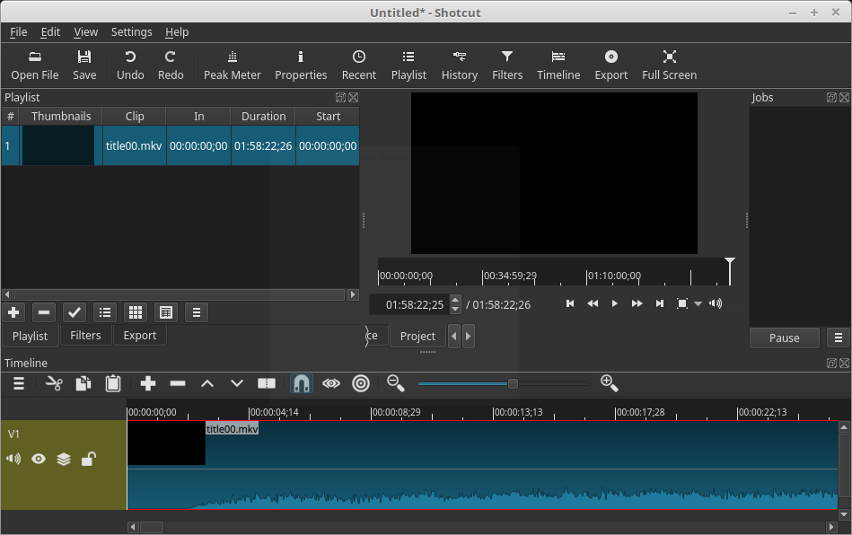
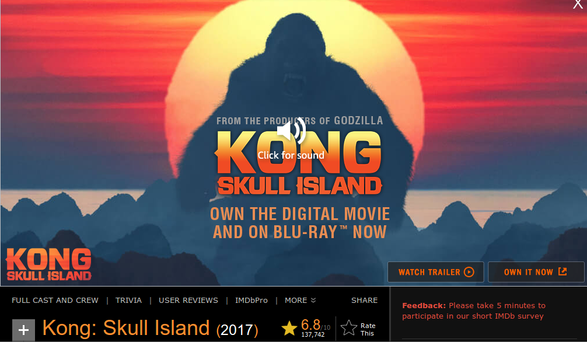

# Video Editing Workflow
> Brief introduction into how I edit videos for my kids.

## Introduction
In today's world not even PG movies are safe. As a responsible parent, I've taken it upon myself to try and keep my kids innocent for as long as I can. I've been editing movies and TV shows for them for several years now.

In that time I've gone through many applications. All have their strengths and weaknesses, but in the end I've settled on the applications and workflow that I'm about to show you.

## The Software
In order to be able to edit videos, you will first need to gather the necessary software. The ones that I use and highly recommend are [MakeMKV](http://www.makemkv.com/) for ripping the movies from DVD and [Shotcut](https://www.shotcut.org/) for the actual editing. Optionally you might want to get [VNC Media Player](https://www.videolan.org/vlc/) which you can use to find out what track the main movie is on.

## Ripping the movie
> DISCLAIMER: Pirating movies is illegal. Only do this with movies that you've purchased.

Put the DVD into your player and then fire up **MakeMKV**. Just click on the big DVD player button in the middle of the interface:

**MakeMKV** will scan your DVD and display all of the tracks that it finds.

Usually the biggest one is the one that you want. If you have a complex DVD with a lot of *titles* then I would recommend using **VNC Media Player** to play the movie. Once the movie is playing, you can look at *Playback-> Title-> DVD Menu*:

> Now you know what *Title* your movie is.

Unselect any of the titles that are not the main movie:

Then click on the **Make MKV** button from the top menu or the one on the top right area of the interface. You'll probably get a warning about the folder not existing, simply accept that it will be created and let it do its thing.

The movie will be ripped to the specified directory. This step will take some time. Just let it do it's thing and go have some coffee.

## Preparing your movie

Once the movie has been ripped, go ahead and close **MakeMKV** and fire up **Shotcut**. The default interface should look something like this:

I'm on a Linux machine, so your're interface might differe a bit. Don't worry, though you'll still be able to follow along.

The first thing that you will want to do is open the following panels from the button menu.

1. Playlist
2. Filters
3. Timeline
4. Export

Once done, your interface should now look something like this:

You will now need to import your movie. Click on the *Open File* button and navigate to the directory where your movie is located and select it.

The movie will start to play by default. You can either stop it or ignore it for now. What you need to do is click on the *Playlist* tab in the middle left side of the interface:

You will then want to add the movie to the *Playlist* by clicking on the **+** button:

Next you will need to drag the movie from the playlist down to the bottom of the interface to the *Timeline*:

Now is the time to save your your project. Give it a good name. Most media servers will accept the name of the movie followed by the year that the movie was released in enclosed in parenthesis. I would recommend looking up the movie on [iMDB](http://www.imdb.com) and getting the full name and year from there.

> Convert any **:** to **-** in the movie's title.

Once your project has been given the proper name and has been saved, you are ready to start editing.:

## Editing your movie
 The first thing you have to do is move the *playhead* to the beginning of the movie. Most likely it will be at the end, so just click on the *Skip to the previous point* button:

 

You might have to click it twice to get it to the beginning of the movie. Once there, simply start watching it. When you get to a point where you have to *mute* the audio or remove that section, simply get the *playhead* right before the part that you want to edit and click on the *split* button:

Either continue to play the movie until you get past the part that you want to edit, or simply drag the playhead by selecting the little arrow and moving it:

You will be able to hear the audio as you drag it. If you find that you can't get to the right spot, try zooming in a bit. I have had good success by clinking at the midway point of the remaining zoom level on the right of its center:

Once you have the right spot, click on the *split* button once again:

### Muting a section of video
Select the section of video that you have just isolated:

On the *Filters* panel, click on the **+** and select *Mute*:

If you've done that successfully, your Filters section should look something like this:

Save your project by clicking on the *Save* button:

To verify, you can move the *playhead* to a point before your edit and then just click on the play button:

### Removing a section of video
Removing a section of video, is just like we demonstrated for the *muting*. Once you've isolated the section that you want to remove, just *right-click* it and select remove:

## Exporting the edited video
Once you've gone through the whole video and are satisfied with your work, it's time to export it. There are many options available, but the one that has always worked for me is to use the *YouTube* profile and export it as an *MP4* file.

Click on the *Export* tab and select the *YouTube* profile from the left hand side:

The defaults work pretty good, but feel free to change any of the settings on the right side. Once you're ready to export it, simply scroll down the right side and click on the *Export* button:

> NOTE: I've found a sort of bug in the name field of the export dialog. There's an invisible character at the end that will cause the movie not to play.

There's a simple fix for the bug though, just put the cursor at the far right end and hit the *backspace* key to remove it. Then click on the *save* button to start the export.

You should now have a progress indicator in the *Jobs* panel:

## Conclusion
That's it!

I didn't go into any of the other features that are provided to you by this fine software; I'll leave that up to you to explore. You now know the basics and they should get your through most of your parenting requirements.

Happy Parenting!
